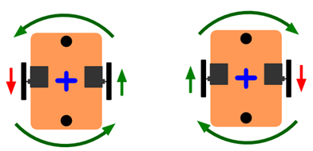
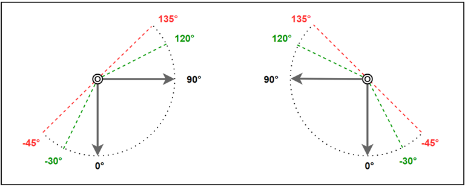
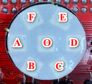
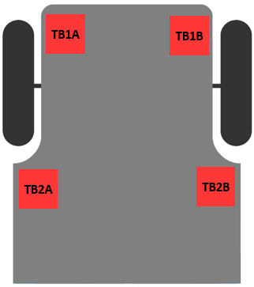
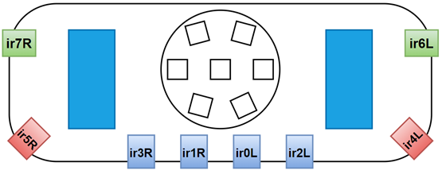

Các hàm điều khiển Leanbot
---

[Arduino tham khảo](https://www.arduino.cc/reference/en/)

[Leanbot](#Leanbot)
- [Leanbot.begin](#Leanbotbegin)
- [LbDelay](#LbDelay)


[Di chuyển ](#Di-chuyển)
- [LbMotion.runLR](#LbMotionrunLR)
- [LbMotion.stopAndWait ](#LbMotionstopAndWait)
- [LbMotion.waitDistance ](#LbMotionwaitDistance)
- [LbMotion.waitDistanceMm ](#LbMotionwaitDistanceMm)
- [LbMotion.waitRotation ](#LbMotionwaitRotation)
- [LbMotion.waitRotationDeg ](#LbMotionwaitRotationDeg)
- [LbMotion.getDistance](#LbMotiongetDistance)
- [LbMotion.getDistanceMm](#LbMotiongetDistanceMm)
- [LbMotion.getRotation](#LbMotiongetRotation)
- [LbMotion.getRotationDeg](#LbMotiongetRotationDeg)


[Tay gắp ](#Tay-gắp)
- [LbGripper.open ](#LbGripperopen)
- [LbGripper.close ](#LbGripperclose)
- [LbGripper.moveTo ](#LbGrippermoveTo)
- [LbGripper.moveToLR ](#LbGrippermoveToLR)
- [LbGripper.readL](#LbGripperreadL)
- [LbGripper.readR](#LbGripperreadR)


[Buzzer ](#Buzzer)
- [Leanbot.tone](#Leanbottone)
- [Leanbot.noTone](#LeanbotnoTone)


[RGB Leds ](#RGB-Leds)
- [LbRGB.show](#LbRGBshow)
- [LbRGB.clear](#LbRGBclear)
- [LbRGB[ ]](#LbRGB[-])
- [LbRGB.fillColor](#LbRGBfillColor)


[Touch Sensors](#Touch-Sensors)
- [LbTouch.read](#LbTouchread)
- [LbTouch.readBits](#LbTouchreadBits)
- [LbTouch.onPress](#LbTouchonPress)


[Ultrasonic Sensor](#Ultrasonic-Sensor)
- [Leanbot.pingCm](#Leanbot.pingCm)
- [Leanbot.pingMm](#Leanbot.pingMm)


[IR Sensors](#IR-Sensors)
- [LbIRLine.read](#LbIRLineread)
- [LbIRLine.value](#LbIRLinevalue)
- [LbIRLine.print](#LbIRLineprint)
- [LbIRLine.displayOnRGB](#LbIRLinedisplayOnRGB)
- [LbIRLine.isBlackDetected](#LbIRLineisBlackDetected)
- [LbIRLine.doManualCalibration ](#LbIRLinedoManualCalibration)
- [LbIRArray.read](#LbIRArrayread)


[DC Motor ](#DC-Motor)
- [Leanbot.DCMotor.setPower](#LeanbotDCMotorsetPower)


&nbsp;
---

# Leanbot

## Leanbot.begin()

### Mô tả
Hàm khởi động Leanbot.

### Cú pháp
```
Leanbot.begin()
```

### Tham số
Không có

### Giá trị trả về
Không có

### Ví dụ
```
#include <Leanbot.h>

void setup() {
  Leanbot.begin();                // initialize Leanbot
}
```

### Chú ý
Hàm này cần được gọi trong hàm `setup`.

[🔼 Trở về đầu trang](#Các-hàm-điều-khiển-Leanbot)
&nbsp;
---

[[ Leanbot ]](#Leanbot)
## LbDelay 

### Mô tả
Hàm này làm cho chương trình chờ cho đến khi hết thời gian trễ được chỉ định, sau đó xử lý dòng lệnh tiếp theo.
Trong khi đó, Leanbot vẫn tiếp tục chạy các hàm khác từ trước, ví dụ như cho Leanbot đi thẳng.

### Cú pháp
```
LbDelay(timeMs)
```

### Tham số
- `timeMs`: Thời gian trễ milli giây (1000 mili giây bằng 1 giây)
  - Đơn vị: ms
  - Khoảng giá trị: [0, 65535]
  - Kiểu dữ liệu: `unsigned int`

### Giá trị trả về
Không có

### Ví dụ
Ví dụ cho Leanbot đi thẳng với vận tốc 400 trong 3 giây, rồi dừng lại
```
LbMotion.runLR(400, 400);    // let Leanbot move forward
LbDelay(3000);               // wait for 3 seconds (Leanbot keeps moving forward)
LbMotion.runLR(0, 0);        // stop Leanbot
```

### Chú ý
Thời gian trễ cao nhất là `65,535` mili giây (≈ 65.5 giây)

[🔼 Trở về đầu trang](#Các-hàm-điều-khiển-Leanbot)
&nbsp;
---

# Di chuyển 


## LbMotion.runLR

### Mô tả
Hàm này đặt tốc độ và hướng quay cho bánh trái và bánh phải.
Tốc độ càng lớn, bánh xe quay càng nhanh.

### Cú pháp
```
LbMotion.runLR(vL, vR)
```

### Tham số
- `vL`: tốc độ bánh trái
- `vR`: tốc độ bánh phải
  - Đơn vị: bước mỗi giây
  - Phạm vi: [-2000, +2000]
  - Giá trị dương: quay tiến
  - Giá trị âm: quay lùi
  - Các loại dữ liệu cho phép: `int`

### Giá trị trả về
Không có

### Ví dụ
Leanbot di chuyển tiến với tốc độ 400.

```
LbMotion.runLR(400, 400);
```
Xem thêm:
- [runLR.ino](examples/LbMotion/runLR.ino)

[🔼 Trở về đầu trang](#Các-hàm-điều-khiển-Leanbot)
&nbsp;
---

[[ Leanbot ]](#Leanbot) / [[ Motion  ]](#Motion)
<!-- ## LbMotion.runLRrpm

### Mô tả
Hàm này đặt tốc độ (vòng quay mỗi phút) và hướng quay cho bánh trái và bánh phải.
Số vòng quay mỗi phút càng lớn, bánh xe quay càng nhanh.

### Cú pháp
```
LbMotion.runLRrpm(rpmL, rpmR)
```


### Tham số
- `rpmL`: tốc độ bánh trái
- `rpmR`: tốc độ bánh phải
  - Đơn vị: RPM - vòng quay mỗi phút
  - Phạm vi: [-60, +60]
  - Giá trị dương: quay tiến
  - Giá trị âm: quay lùi
  - Các loại dữ liệu cho phép: `int`

### Giá trị trả về
Không có

### Ví dụ
Ví dụ này làm cho Leanbot di chuyển tiến với tốc độ 30 vòng mỗi phút
```
LbMotion.runLRrpm(30, 30);
```
Xem thêm:
- [runLRrpm.ino](examples/LbMotion/runLRrpm.ino)

[🔼 Trở về đầu trang](#Các-hàm-điều-khiển-Leanbot)
&nbsp;
---

[[ Leanbot ]](#Leanbot) / [[ Motion  ]](#Motion) -->
## LbMotion.stopAndWait 

### Mô tả
Hàm này dừng Leanbot và đợi cho đến khi Leanbot hoàn toàn dừng hẳn.

### Cú pháp
```
LbMotion.stopAndWait()
```

### Tham số
Không có

### Giá trị trả về
Không có

### Ví dụ

```
LbMotion.stopAndWait();
```

Xem thêm:
- [runLRrpm.ino](examples/LbMotion/runLRrpm.ino)

[🔼 Trở về đầu trang](#Các-hàm-điều-khiển-Leanbot)
&nbsp;
---

[[ Leanbot ]](#Leanbot) / [[ Motion  ]](#Motion)
<!-- ## LbMotion.stopAndWait 

### Mô tả
Hàm này dừng Leanbot và đợi cho đến khi Leanbot giảm tốc hoàn toàn và dừng hẳn.

### Cú pháp

```
isStop = LbMotion.isStop()
```

### Tham số
Không có

### Giá trị trả về
- `true`: Leanbot has stopped
- `false`: Leanbot is moving
- Data type: `bool`

### Ví dụ
```
bool isStop = LbMotion.isStop();
```

[🔼 Trở về đầu trang](#Các-hàm-điều-khiển-Leanbot)
&nbsp;
---

[[ Leanbot ]](#Leanbot) / [[ Motion  ]](#Motion)
## LbMotion.isMoving

### Mô tả
This function checks if Leanbot is moving or not.

### Cú pháp
```
isStop = LbMotion.isMoving()
```

### Tham số
Không có

### Giá trị trả về
- `true`: Leanbot is moving
- `false`: Leanbot has stopped
- Data type: `bool`

### Ví dụ
```
bool isMoving = LbMotion.isMoving();
```

[🔼 Trở về đầu trang](#Các-hàm-điều-khiển-Leanbot)
&nbsp; -->
---

[[ Leanbot ]](#Leanbot) / [[ Motion  ]](#Motion)
## LbMotion.waitDistance 

### Mô tả

Chương trình sẽ chờ cho đến khi Leanbot đã di chuyển một khoảng cách cho trước rồi thực hiện dòng lệnh tiếp theo.

### Cú pháp
```
LbMotion.waitDistance(distanceStep)
```

### Tham số
- `distanceStep`: Khoảng cách Leanbot di chuyển
  - Đơn vị: bước
  - Các loại dữ liệu cho phép: `long`

### Giá trị trả về
Không có

### Ví dụ

```
LbMotion.runLR(400, 400);       // let Leanbot move forward
LbMotion.waitDistance(1500);    // wait for Leanbot to advance 1500 steps
```
See more:
- [waitDistance.ino](examples/LbMotion/waitDistance.ino)

[🔼 Trở về đầu trang](#Các-hàm-điều-khiển-Leanbot)
&nbsp;
---

[[ Leanbot ]](#Leanbot) / [[ Motion  ]](#Motion)

## LbMotion.waitDistanceMm 

### Mô tả
Chương trình đợi cho đến khi Leanbot di chuyển được khoảng cách (xấp xỉ) tính bằng mm sau đó thực hiện dòng lệnh tiếp theo.

### Cú pháp
```
LbMotion.waitDistanceMm(distanceMm)
```

### Tham số
- `distanceMm`: Khoảng cách Leanbot di chuyển tính bằng mm
  - Đơn vị: mm
  - Các loại dữ liệu cho phép: `int`

### Giá trị trả về
Không có

### Ví dụ

```
LbMotion.runLR(400, 400);       // let Leanbot move forward
LbMotion.delayDistanceMm(150);  // wait for Leanbot to advance 150mm = 15cm
```
See more:
- [waitDistanceMm.ino](examples/LbMotion/waitDistanceMm.ino)

[🔼 Trở về đầu trang](#Các-hàm-điều-khiển-Leanbot)
&nbsp;
---

[[ Leanbot ]](#Leanbot) / [[ Motion  ]](#Motion)
## LbMotion.waitRotation 

### Mô tả

Chương trình sẽ chờ cho đến khi Leanbot đã quay được một góc cho trước rồi thực hiện dòng lệnh tiếp theo

### Cú pháp
```
LbMotion.waitRotation(rotationStep)
```

### Tham số
- `rotationStep`: Góc quay của Leanbot
  - Đơn vị: bước
  - Các loại dữ liệu cho phép: `long`

### Giá trị trả về
Không có

### Ví dụ

```
LbMotion.runLR(+400, -400);      // let Leanbot rotate
LbMotion.waitRotation(1500);     // wait for rotating 1500 steps
```
See more:
- [waitRotation.ino](examples/LbMotion/waitRotation.ino)

### Chú ý
Cần phải thực nghiệm và điều chỉnh góc quay để tìm ra giá trị bước tương ứng với góc quay mong muốn
- Giá trị bước sẽ khác nhau đối với mỗi Leanbot, tốc độ và bề mặt chuyển động
- Ví dụ: với tốc độ 500 và giá trị bước là 1750, Leanbot sẽ quay một góc khoảng 90°

[🔼 Trở về đầu trang](#Các-hàm-điều-khiển-Leanbot)
&nbsp;
---

[[ Leanbot ]](#Leanbot) / [[ Motion  ]](#Motion)
## LbMotion.waitRotationDeg 

### Mô tả

Chương trình đợi cho đến khi Leanbot xoay được (xấp xỉ) góc độ mong muốn sau đó thực hiện dòng lệnh tiếp theo.

### Cú pháp
```
LbMotion.waitRotationDeg(rotationDeg)
```

### Tham số
- `rotationDeg`: góc Leanbot sẽ quay
  - Đơn vị: độ
  - Các loại dữ liệu cho phép: `int`

### Giá trị trả về
Không có

### Ví dụ
```
LbMotion.runLR(+500, -500);        // let Leanbot rotate right
LbMotion.waitRotationDeg(180);     // wait for Leanbot to rotate approximately 180°
```

[🔼 Trở về đầu trang](#Các-hàm-điều-khiển-Leanbot)
&nbsp;
---

[[ Leanbot ]](#Leanbot) / [[ Motion  ]](#Motion)
## LbMotion.getDistance

### Mô tả
Hàm này trả về giá trị bước mà Leanbot đã di chuyển

### Cú pháp
```
long distance = LbMotion.getDistance()
```

### Tham số
Không có

### Giá trị trả về
Giá trị bước mà Leanbot đã di chuyển
- Đơn vị: bước
- Loại dữ liệu: `long`

### Ví dụ
```
long distance = LbMotion.getDistance();
```

[🔼 Trở về đầu trang](#Các-hàm-điều-khiển-Leanbot)
&nbsp;
---

[[ Leanbot ]](#Leanbot) / [[ Motion  ]](#Motion)
## LbMotion.getDistanceMm

### Mô tả

Hàm này trả về giá trị khoảng cách theo mm mà Leanbot đã di chuyển

### Cú pháp
```
long distance = LbMotion.getDistanceMm()
```

### Tham số
Không có

### Giá trị trả về
Khoảng cách Leanbot đã di chuyển
- Dơn vị: mm
- Loại dữ liệu: `long`

### Ví dụ
```
long distanceMm = LbMotion.getDistanceMm();
```

[🔼 Trở về đầu trang](#Các-hàm-điều-khiển-Leanbot)
&nbsp;
---

[[ Leanbot ]](#Leanbot) / [[ Motion  ]](#Motion)
## LbMotion.getRotation

### Mô tả
Hàm này trả về giá trị góc mà Leanbot đã quay theo đơn vị bước

### Cú pháp
```
long rotation = LbMotion.getRotation()
```

### Tham số
Không có

### Giá trị trả về
Giá trị góc đã quay của Leanbot
- Đơn vị: bước
- Loại giá trị: `long`

### Ví dụ
```
long rotation = LbMotion.getRotation();
```

[🔼 Trở về đầu trang](#Các-hàm-điều-khiển-Leanbot)
&nbsp;
---

[[ Leanbot ]](#Leanbot) / [[ Motion  ]](#Motion)
## LbMotion.getRotationDeg

### Mô tả
Hàm này trả về giá trị góc mà Leanbot đã quay theo đơn vị độ

### Cú pháp
```
long rotationDegree = LbMotion.getRotationDeg()
```

### Tham số
Không có

### Giá trị trả về
Giá trị góc đã quay của Leanbot
- Đơn vị: độ 
- Loại dữ liệu: `long`

### Ví dụ
```
long rotationDegree = LbMotion.getRotationDeg();
```

[🔼 Trở về đầu trang](#Các-hàm-điều-khiển-Leanbot)
&nbsp;
---

# Tay gắp 


## LbGripper.open 

### Mô tả
This function moves gripper arms to open position (both arms at 0 degree position - perpendicular to the surface)

### Cú pháp
```
LbGripper.open()
```

### Tham số
Không có

### Giá trị trả về
Không có

### Ví dụ
```
LbGripper.open();
```
See more:
- [GripperOpenClose.ino](examples/LbGripper/GripperOpenClose.ino)

[🔼 Trở về đầu trang](#Các-hàm-điều-khiển-Leanbot)
&nbsp;
---

[[ Leanbot ]](#Leanbot) / [[ Gripper  ]](#Gripper)
## LbGripper.close 

### Mô tả
This function moves gripper arms to close position (both arms at 90 degree position - parallel to the surface)


### Cú pháp
```
LbGripper.close()
```

### Tham số
Không có

### Giá trị trả về
Không có

### Ví dụ
```
LbGripper.close();
```
See more:
- [GripperOpenClose.ino](examples/LbGripper/GripperOpenClose.ino)

[🔼 Trở về đầu trang](#Các-hàm-điều-khiển-Leanbot)
&nbsp;
---

[[ Leanbot ]](#Leanbot) / [[ Gripper  ]](#Gripper)
## LbGripper.moveTo 

### Mô tả
This function moves both gripper arms to the same desired angle.

### Cú pháp
```
LbGripper.moveTo(toAngle)
```

### Tham số
- `toAngle`: the degree to move to
  - Unit: degree (angle)
  - Range: [-30, +120]
  - Allowed data types: `int`

### Giá trị trả về
Không có

### Ví dụ
The Ví dụ moves both the gripper arms to the position 45°
```
LbGripper.moveTo(45);
```
See more:
- [GripperMoveTo.ino](examples/LbGripper/GripperMoveTo.ino)

[🔼 Trở về đầu trang](#Các-hàm-điều-khiển-Leanbot)
&nbsp;
---

[[ Leanbot ]](#Leanbot) / [[ Gripper  ]](#Gripper)
## LbGripper.moveToLR 

### Mô tả
This function moves both gripper arms to their desired angles for a desired amount of time.

### Cú pháp
```
LbGripper.moveToLR(toAngleL, toAngleR, timeMs)
```

### Tham số
- `toAngleL`: the degree for left gripper arm to move to
- `toAngleR`: the degree for right gripper arm to move to
  - Unit: degree (angle)
  - Range: [-30, +120]
  - Allowed data types: `int`

- `timeMs`: the time in milliseconds to move both grippers to the target angles
  - Allowed data types: `int`

### Giá trị trả về
Không có

### Ví dụ
The Ví dụ moves the left gripper to position 30° and the right gripper to position 60° for 1.5 seconds
```
LbGripper.moveToLR(30, 60, 1500);
```
See more:
- [GripperMoveToLR.ino](examples/LbGripper/GripperMoveToLR.ino)

[🔼 Trở về đầu trang](#Các-hàm-điều-khiển-Leanbot)
&nbsp;
---

[[ Leanbot ]](#Leanbot) / [[ Gripper  ]](#Gripper)
## LbGripper.readL

### Mô tả
This function Giá trị trả về the current angle (in degrees) of the left gripper arm.

### Cú pháp
```
LbGripper.readL()
```

### Tham số
Không có

### Giá trị trả về
The current angle (in degrees) of the left gripper arm
- Unit: degree (angle)
- Range: [-30, +120]
- Data type: `int`

### Ví dụ
```
int angleL = LbGripper.readL();
```

[🔼 Trở về đầu trang](#Các-hàm-điều-khiển-Leanbot)
&nbsp;
---

[[ Leanbot ]](#Leanbot) / [[ Gripper  ]](#Gripper)
## LbGripper.readR

### Mô tả
This function Giá trị trả về the current angle (in degrees) of the right gripper arm.

### Cú pháp
```
LbGripper.readR()
```

### Tham số
Không có

### Giá trị trả về
The current angle (in degrees) of the right gripper arm
- Unit: degree (angle)
- Range: [-30, +120]
- Data type: `int`

### Ví dụ
```
int angleR = LbGripper.readR();
```

[🔼 Trở về đầu trang](#Các-hàm-điều-khiển-Leanbot)
&nbsp;
---

# Buzzer 

## Leanbot.tone

### Mô tả
This function plays sounds with the specified frequency in a duration of time.
- While playing the sound, Leanbot continues to process the next line of code
- The sound will automatically stop after the duration, or call the [Leanbot.noTone](#Leanbot.noTone) function

### Cú pháp
```
Leanbot.tone(frequency, duration)
```

### Tham số
- frequency: the frequency of the tone in Herzt (Hz)
  - Unit: Herzt (Hz)
  - Allowed data types: `unsigned int`

- duration: (optional) the duration of the tone in milliseconds
  - Unit: ms
  - Allowed data types: `unsigned int`

### Giá trị trả về
Không có

### Ví dụ
Play sound with frequency 1000 Hz for 1.5 s
```
Leanbot.tone(1000, 1500);
```
See more:
- [tone.ino](examples/Buzzer/tone.ino)
- [toneDuration.ino](examples/Buzzer/toneDuration.ino)

### Chú ý
This function is non-blocking, which means that even if you provide the duration parameter
the sketch execution will continue immediately even if the tone hasn't finished playing.

[🔼 Trở về đầu trang](#Các-hàm-điều-khiển-Leanbot)
&nbsp;
---

[[ Leanbot ]](#Leanbot) / [[ Buzzer  ]](#Buzzer)
## Leanbot.noTone

### Mô tả
This function stops the sound played by [Leanbot.tone](#Leanbot.tone)

### Cú pháp
```
Leanbot.noTone()
```

### Tham số
Không có

### Giá trị trả về
Không có

### Ví dụ
```
Leanbot.noTone();
```
See more:
- [noTone.ino](examples/Buzzer/noTone.ino)

[🔼 Trở về đầu trang](#Các-hàm-điều-khiển-Leanbot)
&nbsp;
---

# RGB Leds 

- Leanbot has 7 RGB Leds: `ledA`, `ledB`, `ledC`, `ledD`, `ledE`, `ledF` and `ledO`

## RGB color code
There are 3 different Cú pháp to represent a RGB color:
1. Color name: `CRGB::ColorName`
  - Ví dụ: `CRGB::Red`, `CRGB::Green`, `CRGB::Blue`
  - See more: [https://github.com/FastLED/FastLED/wiki/Pixel-reference#predefined-colors-list](https://github.com/FastLED/FastLED/wiki/Pixel-reference#predefined-colors-list)

2. Decimal code: `CRGB(red, green, blue)`
  - Each parameter (red, green, and blue) defines the intensity of the color with a value between 0 and 255
  - Ví dụ:
    - `CRGB(255, 0, 0)` is red, because red is set to highest value (255), and the other two (green and blue) are set to 0
    - `CRGB(0, 255, 0)` is green, because green is set to highest value (255), and the other two (red and blue) are set to 0
    - To display black, set all Tham số to 0: `CRGB(0, 0, 0)`
    - To display white, set all Tham số to 255: `CRGB(255, 255, 255)`
  - See more: [https://www.w3schools.com/colors/colors_picker.asp](https://www.w3schools.com/colors/colors_picker.asp)

3. Hex code: `0xRRGGBB`
  - Concatenate the 3 hex values of the red, green and blue together
  - Ví dụ: `0xFF0000` (red), `0x00FF00` (green), `0x0000FF` (blue)

## LbRGB.show

### Mô tả
This function shows all Leds to diplay.

### Cú pháp
```
LbRGB.show()
```

### Tham số
Không có

### Giá trị trả về
Không có

### Ví dụ
```
LbRGB.show();
```

### Chú ý
This function must be called after updating the color of the Leds.

[🔼 Trở về đầu trang](#Các-hàm-điều-khiển-Leanbot)
&nbsp;
---

[[ Leanbot ]](#Leanbot) / [[ RGB Leds  ]](#RGB-Leds)
## LbRGB.clear

### Mô tả
This function clears all Leds to black.

### Cú pháp
```
LbRGB.clear()
```

### Tham số
Không có

### Giá trị trả về
Không có

### Ví dụ
```
LbRGB.clear();
```

[🔼 Trở về đầu trang](#Các-hàm-điều-khiển-Leanbot)
&nbsp;
---

[[ Leanbot ]](#Leanbot) / [[ RGB Leds  ]](#RGB-Leds)
## LbRGB[ ]

### Mô tả
This function sets a led to the given RGB color.

### Cú pháp
```
LbRGB[ledX] = color
```

### Tham số
- `ledX`: the led to be set
- `color`: the [RGB color code](#RGB-color-code)

### Giá trị trả về
Không có

### Ví dụ
```
LbRGB[ledA] = CRGB::Red;              // set `ledA` to red
LbRGB[ledO] = CRGB(0, 255, 0);        // set `ledO` to green
LbRGB[ledD] = 0x0000FF;               // set `ledD` to blue
LbRGB.show();                         // show all Leds to diplay
```
See more:
- [setColor.ino](examples/LbRGB/setColor.ino)

### Chú ý
This function only updates the color value of a led
- You have to call [LbRGB.show](#LbRGB.show) to make the leds actually show the new colors

[🔼 Trở về đầu trang](#Các-hàm-điều-khiển-Leanbot)
&nbsp;
---

[[ Leanbot ]](#Leanbot) / [[ RGB Leds  ]](#RGB-Leds)
## LbRGB.fillColor

### Mô tả
This function fills a shape (set of Leds) with a given RGB color.

### Cú pháp
```
LbRGB.fillColor(color, shape)
```

### Tham số
- `color`: the [RGB color code](#RGB-color-code)

- `shape`: a set of Leds to be set
  - Allowed data types: `byte`

### Giá trị trả về
Không có

### Ví dụ
The Ví dụ sets the 4 Leds A, B, C and D (a smiley shape) to green
```
byte LbSmiley = BITMAP(ledA, ledB, ledC, ledD);   // create smiley shape
LbRGB.fillColor(CRGB::Green, LbSmiley);           // fill green color
LbRGB.show();                                     // show all Leds to diplay
```
See more:
- [fillColor.ino](examples/LbRGB/fillColor.ino)

[🔼 Trở về đầu trang](#Các-hàm-điều-khiển-Leanbot)
&nbsp;
---

# Touch Sensors

- Leanbot has 4 touch sensors: `TB1A`, `TB1B`, `TB2A` and `TB2B`

## LbTouch.read

### Mô tả
This function reads the state of the specified touch sensors.

### Cú pháp
```
value = LbTouch.read(tbX)
```

### Tham số
`tbX`: the touch sensor to read. Valid choices are:
- TB1A
- TB1B
- TB2A
- TB2B

### Giá trị trả về
The state the touch sensor
- Value `0`: the sensor is being released
- Value `1`: the sensor is being touched
- Data type: `byte`

### Ví dụ
The Ví dụ reads the state of the sensors `TB1A` and `TB2A`
```
byte value1A = LbTouch.read(TB1A);
byte value2A = LbTouch.read(TB2A);
```
See more:
- [ledControl.ino](examples/LbTouch/ledControl.ino)
- [wheelControl.ino](examples/LbTouch/wheelControl.ino)

### Chú ý
Multiple sensors can be combined and read at once time.
```
LbTouch.read(TB1A | TB1B)
```

[🔼 Trở về đầu trang](#Các-hàm-điều-khiển-Leanbot)
&nbsp;
---

[[ Leanbot ]](#Leanbot) / [[ Touch Sensors ]](#Touch-Sensors)
## LbTouch.readBits

### Mô tả
This function reads the state of all 4 touch sensors.

### Cú pháp
```
touchBits = LbTouch.readBits()
```

### Tham số
- Không có

### Giá trị trả về
The binary state of 4 touch sensors
- Value `0`: the sensor is being released
- Value `1`: the sensor is being touched
- Data type: `byte`

### Ví dụ
```
byte touchBits = LbTouch.readBits();
```
See more:
- [readBits.ino](examples/LbTouch/readBits.ino)

[🔼 Trở về đầu trang](#Các-hàm-điều-khiển-Leanbot)
&nbsp;
---

[[ Leanbot ]](#Leanbot) / [[ Touch Sensors ]](#Touch-Sensors)
## LbTouch.onPress

### Mô tả
This function reads the touching event of the specified touch sensors.

### Cú pháp
```
isOnPress = LbTouch.onPress(tbX)
```

### Tham số
- `tbX`: the touch sensor to read

### Giá trị trả về
The touching event the touch sensor
- Value `true`: the sensor has NOT just been touched, either released or being held
- Value `false`: the sensor has just been touched
- Data type: `bool`

### Ví dụ
The Ví dụ reads the touching state of the sensor `TB1A`
```
bool value1A = LbTouch.onPress(TB1A);
```
See more:
- [onPress.ino](examples/LbTouch/onPress.ino)

### Chú ý
Multiple sensors can be combined and read at once time.
```
LbTouch.onPress(TB1A | TB1B)
```

[🔼 Trở về đầu trang](#Các-hàm-điều-khiển-Leanbot)
&nbsp;
---

# Ultrasonic Sensor

### Chú ý
The ultrasonic sensor can be triggered as fast as every 50 ms, or 20 times each second
- You should wait 50 ms before the next ping
- This is to ensure the ultrasonic __beep__ has faded away and will not cause a false echo on the next ranging

## Leanbot.pingCm

### Mô tả
This function sends a ping and Giá trị trả về the front distance measured in centimeters.

### Cú pháp
```
distanceCm = Leanbot.pingCm()
```

### Tham số
Không có

### Giá trị trả về
The front distance measured in centimeters
- Unit: cm
- Data type: `unsigned int`

### Ví dụ
```
unsigned int distanceCm = Leanbot.pingCm();
```
See more:
- [pingCm.ino](examples/Ping/pingCm.ino)

### Chú ý
The maximum sensor distance is 300 cm, outside this distance, the function will return 1,000 cm.

[🔼 Trở về đầu trang](#Các-hàm-điều-khiển-Leanbot)
&nbsp;
---

[[ Leanbot ]](#Leanbot) / [[ Ultrasonic Sensor ]](#Ultrasonic-Sensor)
## Leanbot.pingMm

### Mô tả
This function sends a ping and Giá trị trả về the front distance measured in millimeters.

### Cú pháp
```
distanceMm = Leanbot.pingMm()
```

### Tham số
Không có

### Giá trị trả về
The front distance measured in centimeters
- Unit: mm
- Data type: `unsigned int`

### Ví dụ
```
unsigned int distanceMm = Leanbot.pingMm();
```

### Chú ý
The maximum sensor distance is `3,000 mm`, outside this distance, the function will return `10,000 mm`

[🔼 Trở về đầu trang](#Các-hàm-điều-khiển-Leanbot)
&nbsp;
---

# IR Sensors


- Leanbot has 8 IR sensors (order 0 - 7), for different purposes:

| Function             | Sensors                   |
| -------------------- |:-------------------------:|
| Line detection       | ir3R - ir1R - ir0L - ir2L |
| Table edge detection | ir5R - ir4L               |
| Obstacles detection  | ir7R - ir6L               |

## LbIRLine.read

### Mô tả
This function reads the value of 4 bar sensors. Used to check the position of the black line relative to Leanbot.

### Cú pháp
```
lineState = LbIRLine.read()
```

### Tham số
Không có

### Giá trị trả về
The binary state of 4 bar sensors
- Value `0`: the sensor is on the white surface
- Value `1`: the sensor is on the black line
- Data type: `byte`

### Ví dụ
```
byte lineState = LbIRLine.read();
```
See more:
- [readLineState.ino](examples/LbIRLine/readLineState.ino)
- [followLine.ino](examples/LbIRLine/followLine.ino)

[🔼 Trở về đầu trang](#Các-hàm-điều-khiển-Leanbot)
&nbsp;
---

[[ Leanbot ]](#Leanbot) / [[ IR Sensors ]](#IR-Sensors)
## LbIRLine.value

### Mô tả
This function Giá trị trả về the value of 4 bar sensors which are read before.

### Cú pháp
```
LbIRLine.value()
```

### Tham số
Không có

### Giá trị trả về
The 4 line sensors value
- Data type: `byte`

### Ví dụ
```
byte lineValue = LbIRLine.value();
```

[🔼 Trở về đầu trang](#Các-hàm-điều-khiển-Leanbot)
&nbsp;
---

[[ Leanbot ]](#Leanbot) / [[ IR Sensors ]](#IR-Sensors)
## LbIRLine.print

### Mô tả
This function sends the value of the 4 bar sensors (which are read before) to the computer.

### Cú pháp
```
LbIRLine.print()
```

### Tham số
Không có

### Giá trị trả về
Không có

### Ví dụ
```
LbIRLine.print();
```

[🔼 Trở về đầu trang](#Các-hàm-điều-khiển-Leanbot)
&nbsp;
---

[[ Leanbot ]](#Leanbot) / [[ IR Sensors ]](#IR-Sensors)
## LbIRLine.displayOnRGB

### Mô tả
This function displays the 4 bar sensors result on RGB Leds with color.
- If any sensor is on the black line, the corresponding RGB Led will light up

### Cú pháp
```
LbIRLine.displayOnRGB(color)
```

### Tham số
- `color`: the [RGB color code](#RGB-color-code)

### Giá trị trả về
Không có

### Ví dụ
```
LbIRLine.read();                     // update line state
LbIRLine.displayOnRGB(CRGB::Blue);   // display result on Leds
```

[🔼 Trở về đầu trang](#Các-hàm-điều-khiển-Leanbot)
&nbsp;
---

[[ Leanbot ]](#Leanbot) / [[ IR Sensors ]](#IR-Sensors)
## LbIRLine.isBlackDetected

### Mô tả
This function checks whether one of the 4 bar sensors is on the black line.

### Cú pháp
```
LbIRLine.isBlackDetected()
```

### Tham số
Không có

### Giá trị trả về
- `true` : the bars sensor is on the black line
- `false`: the bars sensor is NOT on the black line
- Data type: `bool`

### Ví dụ
The Ví dụ lets Leanbot moving forward until the end of the black line
```
LbMotion.runLR(400, 400);                // move forward
while ( LbIRLine.isBlackDetected() );    // keep moving as long as Leanbot can see the black line
LbMotion.stopAndWait();                  // stop
```

[🔼 Trở về đầu trang](#Các-hàm-điều-khiển-Leanbot)
&nbsp;
---

[[ Leanbot ]](#Leanbot) / [[ IR Sensors ]](#IR-Sensors)
## LbIRLine.doManualCalibration 

### Mô tả
This function does 3-step light level calibration with touch button.

### Cú pháp
```
LbIRLine.doManualCalibration(tbX)
```

### Tham số
- `tbX`: the touch sensor used to perform black/white sampling
  - Leanbot has 4 touch sensors: `TB1A`, `TB1B`, `TB2A` and `TB2A`

### Giá trị trả về
Không có

### Ví dụ
```
LbIRLine.doManualCalibration(TB1A);
```
See more:
- [lineCalibration.ino](examples/LbIRLine/lineCalibration.ino)
- [calibrationThenFollowLine.ino](examples/LbIRLine/calibrationThenFollowLine.ino)

### Chú ý
It is recommended to perform this step before starting the mission or when there are changes in ambient light or moving surface.

[🔼 Trở về đầu trang](#Các-hàm-điều-khiển-Leanbot)
&nbsp;
---

## LbIRArray.read

### Mô tả
This function reads the value of the specified sensor.
The darker the surface, the higher the sensor value.

### Cú pháp
```
LbIRArray.read(irX)
```

### Tham số
- `irX`: the sensor to read

### Giá trị trả về
The sensor value: 0 - 768
- Data type: `int`

### Ví dụ
The Ví dụ reads the value of sensor `ir0L` and sends the result to the computer
```
int value = LbIRArray.read(ir0L);    // read the sensor value
Serial.println(value);               // transfer the results to the computer
```

[🔼 Trở về đầu trang](#Các-hàm-điều-khiển-Leanbot)
&nbsp;
---

# DC Motor 

## Leanbot.DCMotor.setPower

### Mô tả
This function makes the motor rotates at a desired speed in the forward or backward direction.
The greater the power, the faster the motor rotates.

### Cú pháp
```
Leanbot.DCMotor.setPower(power)
```

### Tham số
- `power`: the power level
  - Range: [-255, +255]
  - Positive integer: turn forward
  - Negative integer: turn backward
  - 0: turn off
  - Allowed data types: `int`

### Giá trị trả về
Không có

### Ví dụ
The code makes the motor rotates forward at power level of 250
```
Leanbot.DCMotor.setPower(250);
```
See more:
- [setPower.ino](examples/DCMotor/setPower.ino)

### Chú ý
Values out of range will be constrained between -255 and +255

[🔼 Trở về đầu trang](#Các-hàm-điều-khiển-Leanbot)
&nbsp;
---
